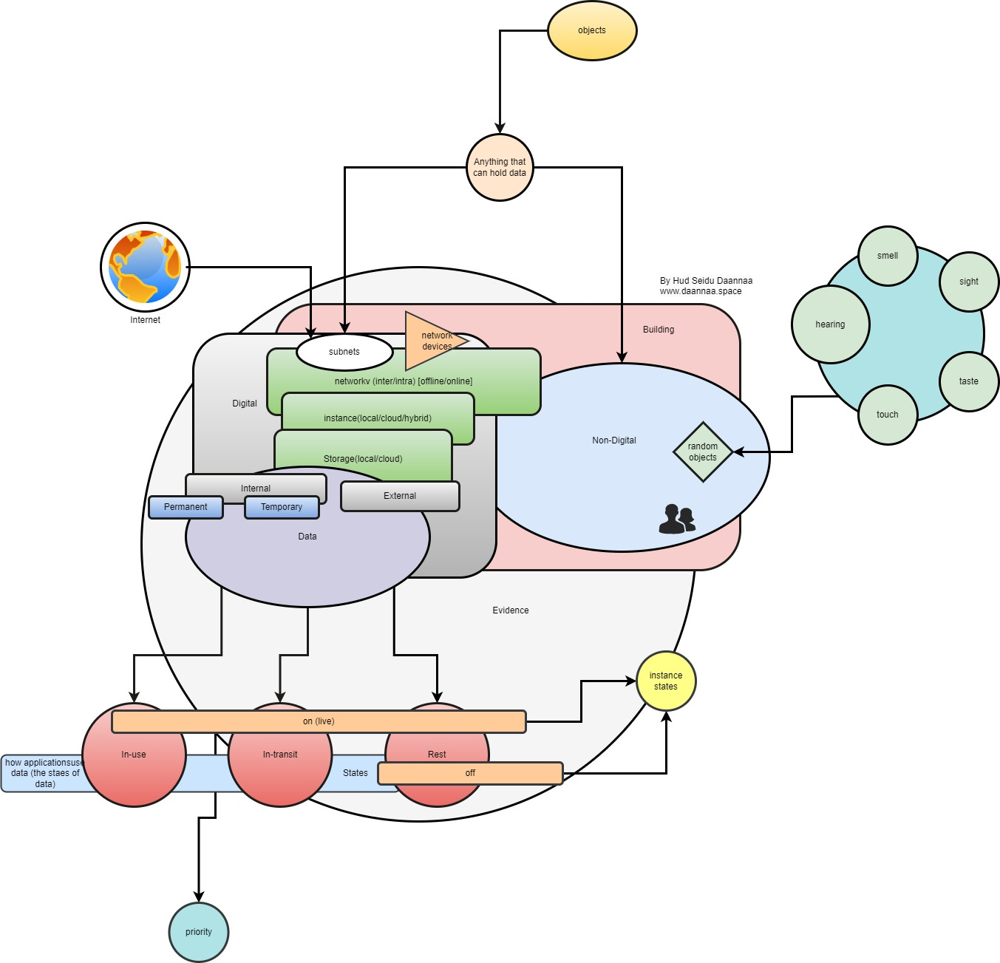

### The Comprehensive Guide to Data Flow in Digital Forensics and Incident Response
#### Hud Seidu Daannaa
#### www.daannaa.space
#### Abstract
Digital Forensics and Incident Response (DFIR) is a critical field in cybersecurity, focusing on the identification, collection, analysis, and preservation of digital evidence. This paper explores a conceptual model illustrating the flow of data from various sources, through different states, to its final classification and prioritization as evidence.

#### Introduction
In today's interconnected world, data can originate from myriad sources, both digital and non-digital. Understanding the flow of this data is essential for effective digital forensics and incident response. This paper provides a detailed look at how data is processed from its origin to its final state as evidence.

#### Diagram

#### Objects and Data Sources
The process begins with **Objects**, representing any item that can hold data. These objects are broadly classified into:

1. **Digital Sources**:
    - **Network Devices**: These include routers, switches, firewalls, and other hardware that facilitate network communication.
    - **Subnets**: Subdivisions within a network, often segmented to manage and secure traffic.
    - **Instances**: Computing resources that can be local, cloud-based, or hybrid, including virtual machines and containers.
    - **Storage Solutions**: Both internal (permanent and temporary) and external, encompassing local drives, cloud storage, and hybrid solutions.

2. **Non-Digital Sources**:
    - **Buildings**: Physical locations where digital and non-digital evidence may be found.
    - **Random Objects**: Various physical items such as notebooks, paper records, and other tangible materials.

#### The Flow of Digital Data
The digital data flow can be broken down into several stages:

1. **Network Devices**:
    - **Internet and Internal Networks (Intranet)**: These networks facilitate the flow of data between devices and subnets.
    - **Offline and Online Networks**: Networks that can be disconnected (offline) or connected (online) to the internet, affecting how data is accessed and transferred.

2. **Subnets and Instances**:
    - **Subnets**: Manage and secure traffic within a network, hosting various instances and storage solutions.
    - **Instances**: Can be local, cloud, or hybrid, each with its own security and data management considerations.

3. **Storage Solutions**:
    - **Internal Storage**: Includes permanent and temporary storage solutions within the organization.
    - **External Storage**: Involves external drives, cloud storage, and other external repositories.

#### The Flow of Non-Digital Data
Non-digital data includes physical evidence that can be crucial in an investigation:

1. **Buildings and Random Objects**:
    - **Buildings**: Physical structures that may contain digital devices or other evidence.
    - **Random Objects**: Physical items like documents, USB drives, or even physical evidence related to the incident.

#### States of Data
Data can exist in several states, each with implications for how it is handled and analyzed:

1. **In-use**: Data that is actively being used or processed.
2. **In-transit**: Data that is being transferred from one location to another, often over a network.
3. **At Rest**: Data that is stored in a stable state, either actively accessible (on) or inactive (off).

#### Evidence Collection and Analysis
The collected data, whether digital or non-digital, becomes part of the evidence pool. The flow from data source to evidence involves several steps:

1. **Identification**: Recognizing relevant data sources and objects.
2. **Collection**: Gathering data from identified sources.
3. **Analysis**: Examining the data to extract relevant information.
4. **Preservation**: Ensuring that data remains intact and unaltered for potential legal proceedings.

#### Priority of Data
Finally, the data is prioritized based on several factors, including its relevance to the investigation, the criticality of the information, and its state (in-use, in-transit, at rest). This prioritization helps focus efforts on the most significant evidence.

#### Conclusion
Understanding the flow of data in digital forensics and incident response is essential for effective cybersecurity operations. By categorizing data sources, recognizing data states, and prioritizing evidence, cybersecurity professionals can more effectively manage and analyze data to respond to incidents and secure digital environments.

This guide serves as a comprehensive overview of the data flow process in DFIR, providing a foundation for further study and application in real-world scenarios. Whether dealing with network devices, storage solutions, or physical evidence, the principles outlined here are crucial for any successful digital forensics and incident response strategy.

#### References
[1] National Institute of Standards and Technology, "Digital Forensics," [Online]. Available: https://www.nist.gov/itl/ssd/digital-forensics. [Accessed: July 15, 2024].

[2] M. Pollitt and R. C. Ward, "The Next Generation of Digital Forensic Tools," IEEE Security & Privacy, vol. 6, no. 1, pp. 48-56, Jan.-Feb. 2008. 

[3] A. K. Jain and R. P. Jadhav, "Digital Forensics and Cyber Crime Databases," in Proc. IEEE Int. Conf. on Computational Intelligence and Computing Research, 2010, pp. 1-6. 

[4] J. V. Shepard and G. M. Dickinson, "Managing Data Collection for Digital Forensics Investigations," IEEE Trans. Information Forensics and Security, vol. 4, no. 4, pp. 573-582, Dec. 2009.

[5] "Digital Evidence and Forensics," U.S. Department of Justice, [Online]. Available: https://www.justice.gov/criminal-ccips/digital-evidence-and-forensics. [Accessed: July 15, 2024].

