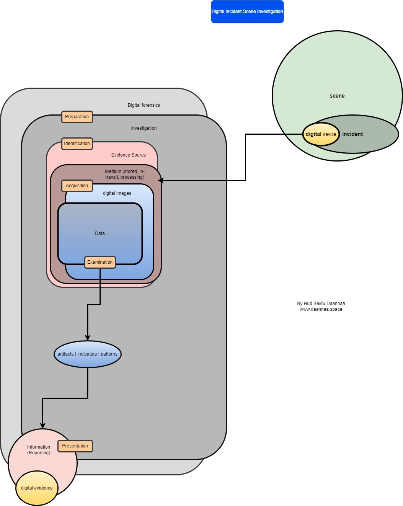

### Digital Incident Scene Investigation Process

#### Hud Daannaa
#### www.daannaa.space

#### Abstract
Digital Incident Scene Investigation (DISI) is a critical aspect of digital forensics, involving the systematic approach to investigating incidents involving digital devices. This paper explores the stages of DISI, from preparation to presentation, detailing the processes involved in acquiring and examining digital evidence.

#### Introduction
Digital incidents involve any events where digital devices are part of the crime scene. Understanding the process of investigating these incidents is crucial for forensic analysts. This paper outlines the stages of Digital Incident Scene Investigation (DISI), emphasizing the importance of each step in ensuring comprehensive and accurate forensic analysis.

#### Stages of Digital Incident Scene Investigation

The process of Digital Incident Scene Investigation is structured into several key stages, each playing a vital role in the overall investigation.

| Stage            | Description                                                                                       | Example                                 |
|------------------|---------------------------------------------------------------------------------------------------|-----------------------------------------|
| **Preparation**  | Initial stage involving planning and readiness for the investigation.                             | Gathering tools and defining procedures. |
| **Identification**| Identifying potential evidence sources at the scene.                                             | Locating digital devices and relevant data. |
| **Acquisition**  | Collecting digital images and data from identified sources.                                       | Creating forensic images of hard drives. |
| **Examination**  | Analyzing the acquired data to identify artifacts, indicators, and patterns.                      | Using forensic tools to analyze file structures and metadata. |
| **Presentation** | Reporting the findings of the investigation.                                                      | Preparing detailed reports and presenting evidence in court. |

#### Detailed Stages and Processes

1. **Preparation**
   - **Definition**: This stage involves planning and ensuring readiness for the investigation.
   - **Activities**: Gathering necessary tools, defining procedures, and ensuring legal authorizations are in place.

2. **Identification**
   - **Definition**: Identifying potential evidence sources within the digital incident scene.
   - **Activities**: Locating digital devices, such as computers, mobile phones, and storage media, that might contain relevant data.

3. **Acquisition**
   - **Definition**: Collecting digital data from the identified sources.
   - **Activities**: Creating forensic images of hard drives, copying data from mobile devices, and capturing network traffic.

4. **Examination**
   - **Definition**: Analyzing the acquired data to identify relevant artifacts, indicators, and patterns.
   - **Activities**: Using forensic tools to analyze file systems, recover deleted files, and identify metadata.

5. **Presentation**
   - **Definition**: Reporting the findings of the investigation in a clear and concise manner.
   - **Activities**: Preparing detailed reports, creating visual representations of data, and presenting evidence in legal settings.

#### Conclusion
Understanding the stages of Digital Incident Scene Investigation (DISI) is essential for conducting thorough and effective forensic investigations. Each stage, from preparation to presentation, plays a crucial role in ensuring that digital evidence is accurately identified, acquired, examined, and reported. This systematic approach helps forensic analysts to uncover crucial information, support legal proceedings, and contribute to the resolution of digital incidents.

#### References
[1] National Institute of Standards and Technology, "Digital Forensics," [Online]. Available: https://www.nist.gov/itl/ssd/digital-forensics. [Accessed: July 15, 2024].

[2] M. Pollitt and R. C. Ward, "The Next Generation of Digital Forensic Tools," IEEE Security & Privacy, vol. 6, no. 1, pp. 48-56, Jan.-Feb. 2008.

[3] A. K. Jain and R. P. Jadhav, "Digital Forensics and Cyber Crime Databases," in Proc. IEEE Int. Conf. on Computational Intelligence and Computing Research, 2010, pp. 1-6.

[4] J. V. Shepard and G. M. Dickinson, "Managing Data Collection for Digital Forensics Investigations," IEEE Trans. Information Forensics and Security, vol. 4, no. 4, pp. 573-582, Dec. 2009.

[5] "Digital Evidence and Forensics," U.S. Department of Justice, [Online]. Available: https://www.justice.gov/criminal-ccips/digital-evidence-and-forensics. [Accessed: July 15, 2024].
