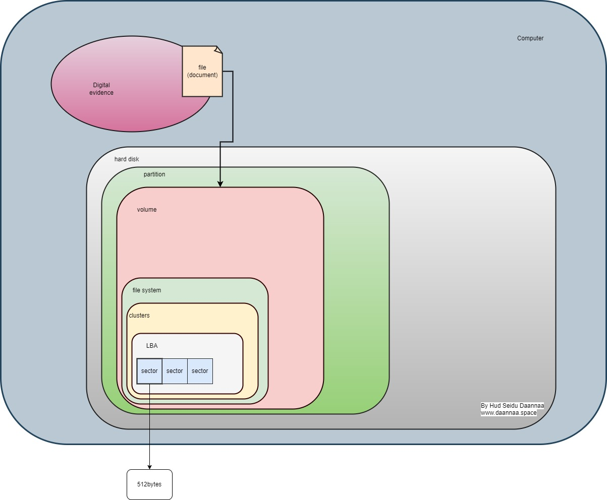

### The Detailed Structure of Digital Evidence in Storage Media
#### Hud Seidu Daannaa
#### www.daannaa.space

#### Abstract
Digital Forensics and Incident Response (DFIR) involves the identification, collection, analysis, and preservation of digital evidence. This paper explores the detailed structure of digital evidence in storage media, explaining the hierarchy from files to the smallest storage units, emphasizing the importance of understanding each layer for effective digital forensics.

#### Introduction
Understanding the structure of digital evidence in storage media is crucial for effective digital forensics and incident response. This paper provides a detailed look at the various layers of storage media, from high-level files to low-level sectors, highlighting the importance of each layer in the context of digital evidence.

#### Diagram

#### Digital Evidence Structure in Storage Media
The structure of digital evidence in storage media can be broken down into several hierarchical layers, each playing a critical role in the storage and retrieval of data.

1. **File (Document)**:
    - The highest level of data represents individual files or documents.
    - Files can include documents, images, videos, system logs, and more.
    - These are the primary units of digital evidence that investigators seek to analyze.

2. **Hard Disk**:
    - The physical storage device where data is stored.
    - Can be internal (inside the computer) or external (portable storage devices).
    - Hard disks are composed of platters, which are magnetic disks that store data.

3. **Partition**:
    - Logical divisions of the hard disk.
    - A single hard disk can be divided into multiple partitions, each functioning as a separate logical disk.
    - Partitions help organize data and can host different operating systems.

4. **Volume**:
    - An accessible storage area within a partition.
    - Volumes are managed by the operating system and have specific file systems.
    - Each volume can be assigned a drive letter (e.g., C:, D:).

5. **File System**:
    - The structure and logic rules used to manage and store files on a volume.
    - Examples include NTFS (New Technology File System), FAT32 (File Allocation Table), and ext4 (extended file system).
    - File systems manage how data is stored and retrieved and provide a way to keep track of files.

6. **Clusters**:
    - The smallest unit of data storage within a file system.
    - A cluster is a group of sectors and is the smallest allocatable unit of storage.
    - Files are stored in one or more clusters, depending on their size.

7. **Logical Block Addressing (LBA)**:
    - A method of specifying the location of blocks of data on the storage device.
    - LBA addresses each sector of the hard disk with a unique number, simplifying data management.
    - This method is crucial for mapping the physical location of data on a disk.

8. **Sectors**:
    - The smallest physical storage unit on a disk, typically 512 bytes in size.
    - Sectors are grouped together into clusters.
    - The integrity of sectors is vital for data retrieval, as corruption can lead to data loss.

#### Detailed Explanations

1. **Files**:
    - **Types of Files**: Various file types (e.g., .txt, .jpg, .mp4) serve different purposes and are analyzed differently during forensic investigations.
    - **File Metadata**: Information about the file, such as creation date, modification date, and file size, which is crucial for forensic analysis.

2. **Hard Disk**:
    - **Components**: Consists of platters, read/write heads, a spindle, and an actuator arm.
    - **Capacity**: Measured in gigabytes (GB) or terabytes (TB), indicating the amount of data the disk can store.

3. **Partition**:
    - **Types**: Primary, extended, and logical partitions.
    - **Partition Table**: A table maintained by the disk that tracks the locations and sizes of partitions.

4. **Volume**:
    - **Mount Points**: Locations in the file system where volumes are mounted and accessed.
    - **Volume Management**: Tools and techniques used to manage volumes, such as resizing and formatting.

5. **File System**:
    - **Functions**: File naming, access control, data recovery, and organization of files.
    - **Fragmentation**: The scattering of file pieces across the storage medium, which can impact performance and complicate forensics.

6. **Clusters**:
    - **Allocation**: How clusters are assigned to files and directories.
    - **Slack Space**: Unused space within a cluster that may contain remnants of previously deleted files.

7. **Logical Block Addressing (LBA)**:
    - **Efficiency**: Enhances data retrieval efficiency by simplifying the addressing of data blocks.
    - **Mapping**: LBA provides a linear mapping of sectors, facilitating easy translation between logical and physical addresses.

8. **Sectors**:
    - **Sector Size**: Standard sector size is 512 bytes, though modern drives may use 4,096-byte sectors.
    - **Error Correction**: Mechanisms in place to detect and correct errors within sectors, ensuring data integrity.

#### Conclusion
Understanding the detailed structure of digital evidence in storage media is essential for effective digital forensics. By recognizing each layer's role and significance, cybersecurity professionals can more effectively manage and analyze data to support incident response and forensic investigations. This knowledge enables the precise recovery and analysis of digital evidence, ensuring comprehensive and accurate forensic processes.

#### References
[1] National Institute of Standards and Technology, "Digital Forensics," [Online]. Available: https://www.nist.gov/itl/ssd/digital-forensics. [Accessed: July 15, 2024].

[2] M. Pollitt and R. C. Ward, "The Next Generation of Digital Forensic Tools," IEEE Security & Privacy, vol. 6, no. 1, pp. 48-56, Jan.-Feb. 2008.

[3] A. K. Jain and R. P. Jadhav, "Digital Forensics and Cyber Crime Databases," in Proc. IEEE Int. Conf. on Computational Intelligence and Computing Research, 2010, pp. 1-6.

[4] J. V. Shepard and G. M. Dickinson, "Managing Data Collection for Digital Forensics Investigations," IEEE Trans. Information Forensics and Security, vol. 4, no. 4, pp. 573-582, Dec. 2009.

[5] "Digital Evidence and Forensics," U.S. Department of Justice, [Online]. Available: https://www.justice.gov/criminal-ccips/digital-evidence-and-forensics. [Accessed: July 15, 2024].
